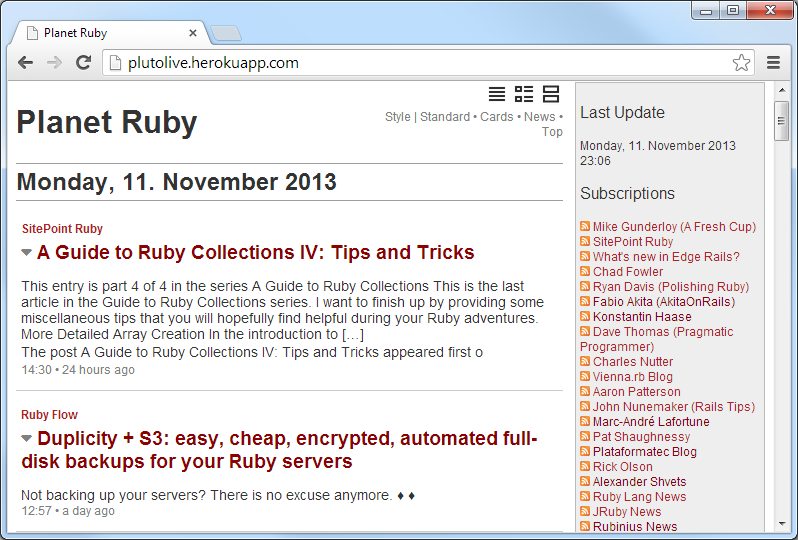

## What's Pluto?   {#whatis}

A planet site generator in ruby
that lets you build web pages from published web feeds.


## Getting Started    {#start}

### Step 1 - Add all web feeds to your planet configuration

Add all web feeds to add to your planet news site
to your planet configuration file.

Example - `planet.ini`:

```
title = Planet Ruby

[rubylang]
  title = Ruby Lang News
  link  = http://www.ruby-lang.org/en/news
  feed  = http://www.ruby-lang.org/en/feeds/news.rss

[rubyonrails]
  title = Ruby on Rails News
  link  = http://weblog.rubyonrails.org
  feed  = http://weblog.rubyonrails.org/feed/atom.xml

[viennarb]
  title = Vienna.rb News
  link  = http://vienna-rb.at
  feed  = http://vienna-rb.at/atom.xml
```


### Step 2 - Auto-build your planet news site

Use the `pluto` command line tool and pass in the
planet configuration file. Example:

```
$ pluto build ruby.ini
```

This will

1) fetch all feeds listed in `planet.ini` and

2) store all entries in a local database, that is, `planet.db` in your working folder and

3) generate a planet web page, that is, `planet.html` using the [`blank` template pack](https://github.com/planet-templates/planet-blank) in your working folder using all feed entries from the local database.

Open up `planet.html` to see your planet web page. Voila!





### Bonus: Try different templates/theme packs

Don't like the look and feel of the built-in standard blank theme / template?
Use a different planet theme or design your own.

See the ["Planet Templates"](https://github.com/planet-templates) site for more free themes / templates including:

- Blank - default templates; [more »](https://github.com/planet-templates/planet-blank)
- News - 'river of news' style templates; [more »](https://github.com/planet-templates/planet-news)
- Top -  Popurl-style templates; [more »](https://github.com/planet-templates/planet-top)
- Classic -  Planet Planet-Style templates; [more »](https://github.com/planet-templates/planet-classic)


### Planet configuration samples   {#config}

For more planet configuration samples
or real world setups (with live planet news sites) see the
[Planets](https://github.com/feedreader/planets) repo.
Samples include:

[`nytimes.ini`](https://github.com/feedreader/planets/blob/master/nytimes.ini),
[`js.ini`](https://github.com/feedreader/planet-web/blob/master/js.ini),
[`dart.ini`](https://github.com/feedreader/planet-web/blob/master/dart.ini),
[`haskell.ini`](https://github.com/feedreader/planets/blob/master/haskell.ini).

Real world setups include:

- [OpenStreetMap Blogs](https://blogs.openstreetmap.org) - [(Setup)](https://github.com/gravitystorm/blogs.osm.org)
